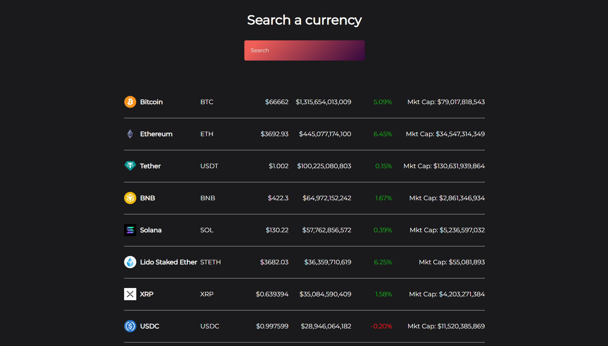

<div align="center">

# Cryptocurrency Price Tracker✨

## ✨ [Live Preview](https://darshan-cryptocurrency-price-tracker.netlify.app/)

</div>

## 🤷🏼‍♂️ About This Project

📈 Check crypto prices on the go! <br>
💰 Find market cap data in a snap. <br>
🕒 Track price changes with percentages. <br>
🔍 Search for any cryptocurrency you desire. <br>
🚀 Stay informed about crypto trends. <br>
💡 Easy, quick, and user-friendly!

<div align='center'>

</div>

##

- To check the market capitalization of a specific cryptocurrency, the user can search for it using the search bar and view its current market cap alongside other relevant data.

- To check whether the price of a specific cryptocurrency has gone up or down, the user can search for it using the search bar and view its current price as well as its price change over various time periods.

- The price change will be indicated by a percentage increase or decrease, allowing the user to quickly determine whether the cryptocurrency has gone up or down in value.

# ⚡Tech Stack

**Front End :** ReactJS

**Development Environment :** Vite

**API :** [Coingecko API](https://www.coingecko.com/en/api)

## 🚀 Getting Started

Clone the project

```bash
  git clone https://github.com/darshangaikwad4114/Cryptocurrency-Price-Tracker.git
```

Go to the project directory

```bash
  cd Cryptocurrency-Price-Tracker
```

Install dependencies

```bash
  npm install
```

Start the server

```bash
  npm run start
```

## ✊ Show your support

Give a ⭐️ if this project helped you!

# 📝License

[](https://github.com/darshangaikwad4114/Cryptocurrency-Price-Tracker/blob/main/LICENCE)

# 🙌🏻 Feedback

If you have any feedback, please reach out to us at --> darshangaikwad4114@gmail.com
